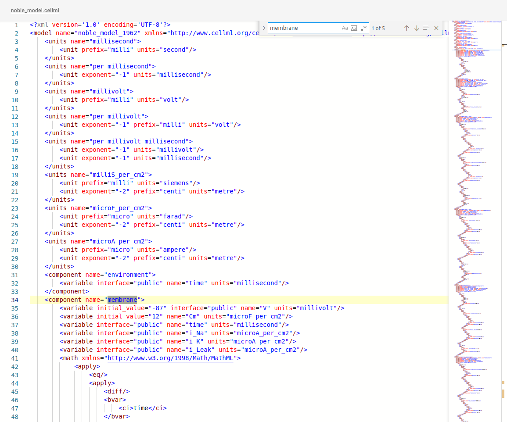
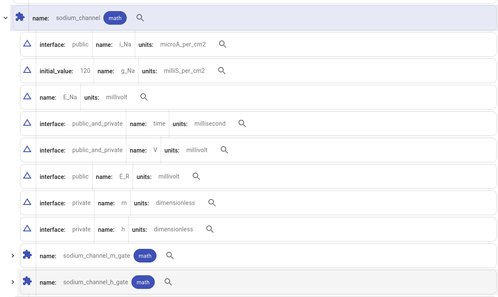
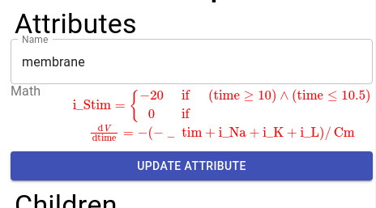
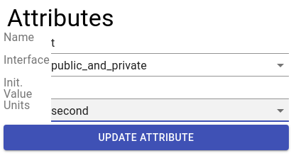

# Electron Cell(ML) Editor

A GUI editor for the [CellML language](https://www.cellml.org/)

## Features

### CellML 2.0 Supported!
Using libcellml's API lets this application parse and create CellML 2.0 files regardless of the implementation.

### Text Editing

Integrated the Monaco editor into this project to enable smooth text editing with line numbers, syntax highlighting and an overview of the file you're currently working on.

## Compressed Visualisation


Read CellML based on what matters. Instead of showing raw XML, files can also be represented as a tree showing only crucial information. This allows for a simpler overview of the CellML file.

## MathML Rendering


Read MathML equations quickly as it gets automatically formatted into readable formulas. 

## Formatted Editing



Create and edit CellML elements using forms to avoid common mistakes. 

## Download Now!
Release is available [here](https://github.com/Moop204/ElectronCellEditor/releases/tag/v1.0.0)


## How to Build

Clone this repo  

```
git clone https://github.com/Moop204/ElectronCellEditor
```

Run yarn inside the root folder to install required packages.  

```
cd ElectronCellEditor
yarn
```

After the packages are downloaded you can now either:

### Run the Application

```
yarn start
```

### Build the Application
Package the application locally and then move to the out folder where the application is built. By default it packages to your device's platform. 

```
yarn package
cd out
```

Find the binary for your system and then execute it.

## Note
Currently this application relies on an in-dev version of libcellml. Until they fully release their javascript port that contains the features this application relies, that version of libcellml is precompiled on a Linux device and located in 'src/backend/mainLibcellml'. This may not work on other operating systems and require you to build the libcellml library yourself.